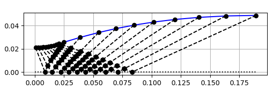
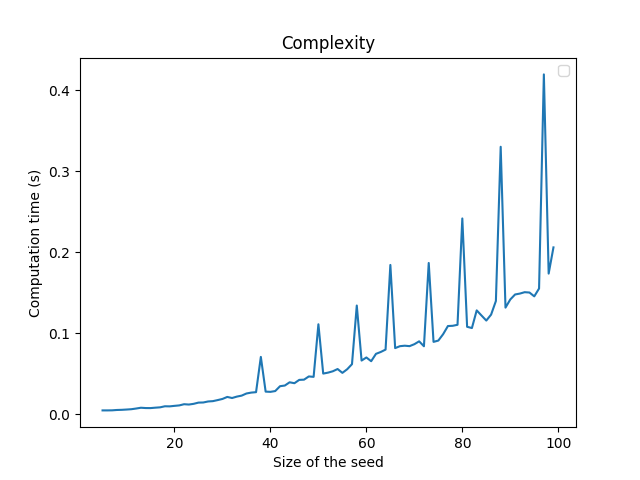

# nozzle_design
This code was develloped by Nicolas LINDEN and Charles MALITOURNE as part of a third year qualifying project at École Nationale Supérieur d'Arts et Métiers. Its goal is to help design the geometry of supersonic nozzles. It is based on the method of characteristics and is in part inspired by the algorithm described in John D. Anderson's book 'Fundamentals of Aerodynamics, Fifth Edition'. It uses an ideal gas model and make the assumption of an iso-entropic flow, and allows the user to modify the nozzle's parameters to their liking. It makes use of the CoolProp python3 wrapper available at coolprop.org. Development is still ongoing but basic options are all available.

The code allows you to design two types of nozzle : 
* standard nozzle with an expansion section :




* minimum length nozzles :


## Required Python3 library
This code only work on python3.
Necessary packages are : CoolProp, csv, matplotlib, numpy, math, time.

## Creating a Nozzle
First create a new file that will contain the parameters for your nozzle.
In this file, type :
```
#!/usr/bin/python3
from Nozzle import *
Nozzle(
physics = {
'mass_flow' : 4 ,  #kg/s
'tank_pressure' : 10e5 , #Pa
'tank_temperature' : 573 , #K
'specific_gas_constant' : 287.05 , #J/kg/K
'exit_pressure' : 1e5,  #Mach
'gamma' : 1.4
},
geometry = {
'nozzle_type' : 'expansion' ,
'initial_angle' : 0.01 ,
'step_number' : 100,
},
results = {
'display_tables' : True ,
'save_tables' : True ,
'display_figure' : False ,
'save_figure' : True ,
},
)
```
This example is provided in the tuyere.jdd file in the repository. To launch the program simply use the ./file_name command (Don't forget to chmod it adequately).
You should adapt the python3 path to your system, or alternatively delete the line and just use the "python3 file_name" command.
You can then modify the parameters to your liking.

### Physics dictionnary
The physics dictionnary contains the physical characteristic of the nozzle, they are :
* The 'mass_flow' going through the nozzle
* The 'tank_pressure' and 'tank_temperature' are the P/T condition in the tank upstream from your nozzle, this is used in the code as a way to define totale temperature and pressure (i.e. the dynamic Pressure (resp. Temperature) is zero for a Mach number of zero)
* The 'specific_gas_constant' of the fluid, the default 287.05 J/kg/K is for Air. You can find data for other fluids in the CoolProp library.
* 'exit_pressure' specifies the pressure you want at the nozzle's exit.
* Alternatively, you can use the exit_mach parameter to specify a Mach number at the nozzle's exit (Don't use both exit pressure and Mach parameters, this would not work properly)
* 'gamma' is the Heat capacity ratio, equal to 1.4 for diatomic real gases, and to 1.67 for monoatomic real gases. You can use CoolProp to get more values for any fluid.
### Geometry dictionnary
These parameters partain to the nozzle geometry, and to the algorithm's initial data line.
* The 'nozzle_type' parameter allows you to choose to create either a minimal length nozzle, or a standard nozzle with an expansion section. keyword are 'minimal' and 'expansion'.
* 'initial_angle' allows you to define the angle of your very first right-running characteristics, a smaller angle will results in a better precision in the region just right of the initial data line. 
* 'step_number' allows you to choose to number of initial node in the initial data line, move step means better precision, but also longer computation time. The following graph represent the computation time with respect to the number of steps.



I don't know the reasons for the spike yet, however computing a single noz remains very quick in terms of calculations.
### Results dictionnary
* 'display_tables' is used to display your nozzle's characteristics after it is computed, it uses a custom made vtable classe provided with the files to display. It work well with the monospace regular font, not so much with others. This will be refactored to work with any font.
* 'save_table' does not work yet

## Creating multiple nozzle in one script
If you wish to do a parametric study (for instance if you want to graph the exit section's area with respect to the exit mach number). You can use the Nozzle.iterate() function, and input a list of parameters in the desired fields. You can also add the 'iter_out_param' keyword to the results dictionnary, the program will then display a table with two columns, one for the parameter you changed, and the other for the studied quantity (for now, it only work with computation_time and area_ratio).
The data set for a nozzle iteration should look something like this :
```

#!/usr/bin/python3
from Nozzle import *
Nozzle.iterate(
physics = {
'mass_flow' : 4 ,  #kg/s
'tank_pressure' : 10e5 , #Pa
'tank_temperature' : 573 , #K
'specific_gas_constant' : 287.05 , #J/kg/K
'exit_mach' : [2,3,4,5],  #Mach
'gamma' : 1.4
},
geometry = {
'nozzle_type' : 'expansion' ,
'initial_angle' : 0.01 ,
'step_number' : 100,
},
results = {
'display_tables' : True ,
'save_tables' : True ,
'display_figure' : False ,
'save_figure' : True ,
'iter_out_param' : 'area_ratio',
},
)
```
An example of such an iteration is the following graph :

